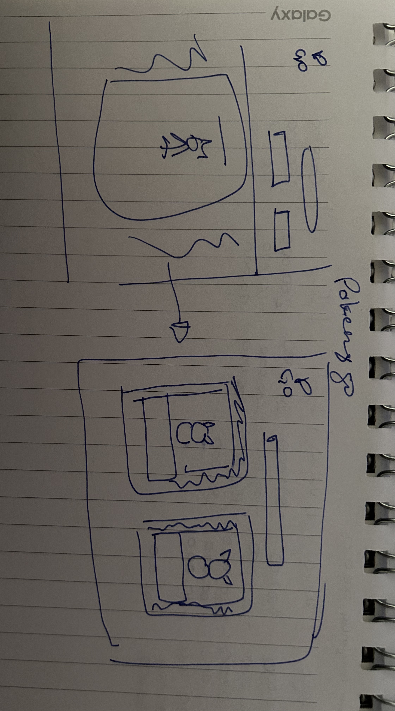
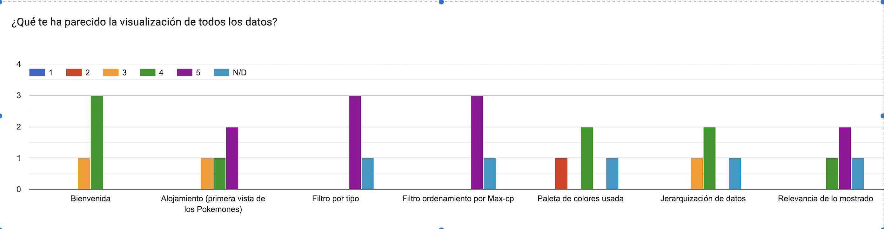
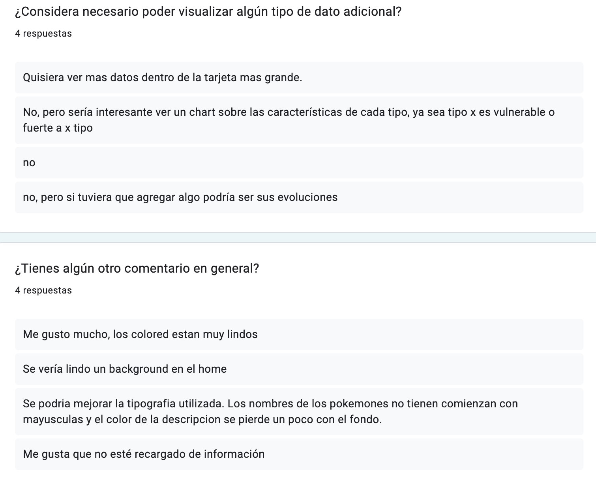

# Pokemon GO.

## Índice

* [1. Resumen del proyecto](#2-resumen-del-proyecto)
* [2. Hallazgos](#2-hallazgos)
* [3. Historias de Usuario](#3-historias-de-usuario)
* [4. Prototipos](#4-prototipos)
* [5. Funcionalidad](#5-funcionalidad)
* [6. Test de usabilidad](#6-test-de-usabilidad)
* [7. Proyecto](#7-proyecto)
* [8. Checklist](#9-checklist)

***

## 1. Resumen del proyecto

En este proyecto nos enfocamos en el aprendizaje sobre el manejo de datos, donde la temática escogida va direccionada a los pokemones y sus características principales. 

El objetivo inicial a desarrollar estaría enfocado a crear una página web relevante para nuestros usuarios finales, _maestros y aficionados del mundo Pokemon Go_. 

Quisimos envolvernos de la esencia del mundo Pokemon e inspirarnos para crear un diseño amigable manteniendo una jerarquía limpia donde puedas conocer sin mayores dificultades características relevantes del pokemón elegido. 

En la página principal encuentras una bienvenida interactiva con uno de los elementos más conocidos, la pokebola. Con un simple click ingresas. 

Nuestra siguiente pantalla muestra todos los pokemones que puedes encontrar en la Primera Generación, además de nuestras funcionalidades principales. Podrás: 

- Filtrar por tipo de pokemón. 
- Ordenar de forma ascendente o descendente por “Puntos de combate”. 
- Ingresar un nombre de pokemón que conozcas. 

## 2. Hallazgos
- Los Pokémon tienen características únicas que determinan las decisiones que
  toma el usuario. 
- Los Pokémon tienen distintos tipos y debilidades de combate. Estas
  características son importantes cuando un maestro Pokémon elige al Pokémon
  más adecuado para su batalla. Hay veces que tiene que elegir a los que
  tienen menos cantidad de debilidades y saber de que tipo son. Por ello, es
  importante para un maestro Pokémon poder ordenarlos por estas 2
  características.

## 3. Historias de usuario

  Historía de Usuario 1:

  _Yo como_ MAESTRO POKEMON 
  _QUIERO SABER_ QUÉ POKEMONES SE ENCUENTRAN DENTRO DE UNA MISMA CATEGORÍA DE TIPO 
  _PARA_ ESTUDIAR LOS POKEMONES ANTES DE UN EVENTO

  CRITERIOS DE ACEPTACIÓN

  EL USUARIO PUEDE FILTRAR POR TIPO DE POKEMON
  SI ELIGE FUEGO, QUE APAREZCAN SOLO LOS POKEMONES DE TIPO FUEGO Y LOS OTROS QUEDEN OCULTOS
  PUEDE HACER CLICK EN UN POKEMON PARA SABER MÁS INFORMACIÓN

DEFINICIÓN DE TERMINADO:

* [x] DISEÑO RESPONSIVO.
* [x] QUE FUNCIONEN LOS FILTROS
* [x] CÓDIGO CUMPLE CON LA GUÍA DE ESTILOS ACORDADA
* [x] CÓDIGO ESTÁ EN EL REPOSITORIO
* [x] CODIGO TIENE Y PASA LOS TEST NECESARIOS

  Historia de usuario 2: 

  _Yo como_ MAESTRO POKEMON 
  _QUIERO SABER_ CONOCER LOS POKEMONES DEL MÁS FUERTE AL MÁS DÉBIL
  _PARA_ INFORMARME SOBRE CADA UNO ANTES DE PELEAR EN UN GIMNASIO

  CRITERIOS DE ACEPTACIÓN

  EL USUARIO PUEDE ORDENAR DEL MÁS FUERTE AL MÁS DÉBIL Y VICEVERSA.
  EL USUARIO PUEDE VER UN LISTADO DE CADA POKEMON JUNTO CON SU PC

DEFINICIÓN DE TERMINADO:

* [x] DISEÑO RESPONSIVO.
* [x] QUE FUNCIONEN LOS FILTROS ASCENDENTE Y DESCENDENTE
* [x] CÓDIGO CUMPLE CON LA GUÍA DE ESTILOS ACORDADA
* [x] CÓDIGO ESTÁ EN EL REPOSITORIO
* [x] CODIGO TIENE Y PASA LOS TEST NECESARIOS

Historia de usuario 3: 

  _Yo como_ JUGADOR QUE QUIERE ENFRENTARSE A BATALLAS IMPORTANTES DENTRO DEL GIMNASIO
  _QUIERO SABER_ CONOCER LA ENERGÍA POR SEGUNDO QUE GENERA EL ATAQUE DE MI POKEMON 
  _PARA_ PREPARARME MEJOR ANTES DE CADA BATALLA

  CRITERIOS DE ACEPTACIÓN

  EL USUARIO PUEDE BUSCAR POR NOMBRE
  EL USUARIO VE SOLO LA TARJETA SELECCIONADA
  CADA TARJETA TIENE LA OPCIÓN DE “VER ESTADÍSTICAS”
  APAREZCA LAS ESTADÍSTICAS EPS

DEFINICIÓN DE TERMINADO:

* [x] DISEÑO RESPONSIVO.
* [x] QUE FUNCIONES INPUT DE BÚSQUEDA POR NOMBRE POKEMON
* [x] CÓDIGO CUMPLE CON LA GUÍA DE ESTILOS ACORDADA
* [x]  PUEDES HACER CLICK EN BOTON ESTADÍSTICAS 
* [x] PUEDES VISUALIZAR EL EPS DE CADA POKEMÓN. 
* [x] CÓDIGO ESTÁ EN EL REPOSITORIO
* [x] CODIGO TIENE Y PASA LOS TEST NECESARIOS

## 4. Prototipos

_Prototipos de baja fidelidad_

[Link a nuestro Figma - Prototipo de baja fidelidad](https://www.figma.com/file/UScyGw3XaBn2wp063kscqe/Low-Prototype-Data-Lovers?type=design&node-id=4-65&t=yeLwt11o5ItqhnAX-0)

_Prototipos de alta fidelidad_

[Link a nuestro Figma - Prototipo de alta fidelidad](https://www.figma.com/file/jOcDABLVVvg3UWZtTKaPDb/High-Prototype-Data-Lovers?type=design&node-id=0-1&t=mZgFDi4mOKvO3ig7-0)

## 5. Funcionalidad

En este proyecto podrás realizar las siguientes acciones: 

- Filtrar por el nombre que conozcas de pokemón. Al momento de ingresar alguna letra en nuestro buscador podrás visualizar todos los pokemones los cuales en su nombre contengan las letras ingresadas. 
- Filtrar por los tipos conocidos de pokemon contenidos en la primera generación. 
- Podrás organizar toda la generación de forma ascendente o descendente tomando como referencia el "MAX-CP" de cada uno. Correspondiente a su puntaje más alto de combate.
- Podrás ver el total EPS al seleccionar cada pokemón, corresponde a un calculo realizado tomando en cuenta sus ataques, energía y tiempo utilizado en cada uno. 

### Test 

Se realizaron pruebas unitarias para las funciones encargadas de  _procesar_,
_filtrar_ y _ordenar_ la data, así como _calcular_ estadísticas.

Nuestrsa pruebas unitarias arrojan una cobertura del 100% de statements
sentencias, funciones, lineas, y branches del archivo `src/data.js`.

## 6. Test de usabilidad

Se realizó una encuesta corta comprendida por preguntas cerradas y abiertas para conocer mejor la opinión de usuarios con respecto a su experiencia con la página, incluyendo recomendaciones a tener en cuenta para mejorar la experiencia. 

Elementos a mejorar: 
- Diseño en detalle de la página, elementos más dinámicos y mejor resolución de la información. 

## 7. Proyecto

[Link a nuestro GitHub Pages]()
## 9. Checklist

* [x] Usa VanillaJS.
* [x] Pasa linter (`npm run pretest`)
* [x] Pasa tests (`npm test`)
* [x] Pruebas unitarias cubren un mínimo del 70% de statements, functions y
  lines y branches.
* [x] Incluye _Definición del producto_ clara e informativa en `README.md`.
* [x] Incluye historias de usuario en `README.md`.
* [x] Incluye _sketch_ de la solución (prototipo de baja fidelidad) en
  `README.md`.
* [x] Incluye _Diseño de la Interfaz de Usuario_ (prototipo de alta fidelidad)
  en `README.md`.
* [x] Incluye link a Figma en `README.md`.
* [x] Incluye el listado de problemas que detectaste a través de tests de
  usabilidad en el `README.md`.
* [x] UI: Muestra lista y/o tabla con datos y/o indicadores.
* [x] UI: Permite ordenar data por uno o más campos (asc y desc).
* [x] UI: Permite filtrar data en base a una condición.
* [x] UI: Es _responsive_.
